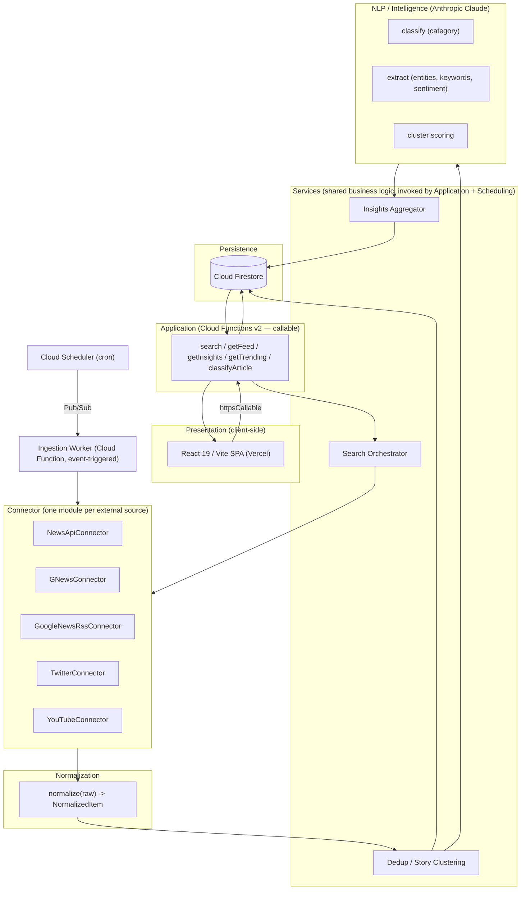

# Architecture

BoxNewsBooster's Trend & News Intelligence module is being expanded from a
2-provider (NewsAPI.org, GNews), search-on-demand system into a multi-source
aggregation, classification, and insights platform. This document defines the
target layered architecture and maps each layer onto a concrete Firebase/GCP
primitive.

## Layered view

## Layer → Firebase/GCP mapping

| Layer | Implementation | Why this and not the alternative |
|---|---|---|
| Presentation | React/Vite SPA, deployed on **Vercel** (not Firebase Hosting — deliberate, see `security-strategy.md` §Hosting) | Already decided in Phase 0; no reason to run two hosting pipelines |
| Application (API) | **Cloud Functions v2, `onCall`** (`fetchNews`, `classifyArticle`, `getSearchTrends`, and new `search`/`getInsights`/`getTrending`) | Callable functions give free auth-token plumbing, App Check integration, and typed client SDK — no hand-rolled CORS/REST layer needed |
| Services | Plain TypeScript modules under `functions/src/services/`, imported by both callables and the ingestion worker | Business logic must not live inside a single callable — the same orchestration (dedup → classify → score) runs on-demand (search) and on-schedule (ingestion) |
| Connector | One module per source under `functions/src/connectors/`, each implementing `IConnector` (see `connector-interface.md`) | Isolates per-source API quirks (auth scheme, pagination, rate limits) behind one contract |
| Normalization | `functions/src/shared/normalize.ts` (per-connector `normalize()` + a shared merge step) | Every downstream layer (dedup, NLP, Firestore writes, frontend) works against one `NormalizedItem` shape regardless of source |
| Ingestion trigger | **Cloud Scheduler → Pub/Sub → Cloud Function (event-triggered, gen2)** | Firebase Functions v2 supports Pub/Sub triggers natively; no separate Cloud Run service needed at current scale (see `scalability-roadmap.md` for when that changes) |
| Retry/backoff | **Cloud Tasks** queues, one per connector | Per-source rate-limit isolation — a Twitter 429 must not stall NewsAPI ingestion (see `queue-strategy.md`) |
| NLP/Intelligence | Anthropic Claude via existing `functions/src/lib/classify.ts`, extended with entity/keyword/sentiment extraction in the same tool-use call | Already proven in production (Feature 2); extending the existing call is cheaper than a second LLM round-trip |
| Persistence | **Cloud Firestore**, single region (`us-central1`, matching function region) | Already provisioned; see `database-schema.md` for the target schema |
| Secrets | **Secret Manager** via `firebase functions:secrets:set`, one secret per provider API key | Already the pattern for the 3 existing keys; extends cleanly to Twitter/YouTube |

## Why everything stays on Cloud Functions v2 (not a separate Cloud Run service)

Firebase Functions v2 **is** Cloud Run under the hood — each function is its
own Cloud Run service with its own scaling, memory, and timeout config. There
is no capability we currently need (long-lived connections, custom
containers, >60 min execution) that requires stepping outside the Functions
abstraction. Running a bespoke Cloud Run service today would mean a second
deploy pipeline and IAM surface for zero functional benefit. Revisit only if
ingestion fan-out grows into the hundreds of concurrent source polls (see
`scalability-roadmap.md`).

## What's genuinely new vs. what's a relabeling of Phase 0 work

- **New**: Connector layer, Services layer (dedup/clustering/insights),
  scheduled ingestion, Cloud Tasks queues, expanded Firestore schema.
- **Relabeled**: `functions/src/providers/{newsApiOrgProvider,gnewsProvider}.ts`
  already do 80% of what `IConnector.fetch()`/`normalize()` will do — Phase 2
  migrates them into `connectors/`, it does not rewrite them from scratch.
- **Unchanged**: Firestore deny-all security rules, Secret Manager secret
  handling, `claude-sonnet-5` via the existing `config/anthropic` runtime-config
  pattern.
