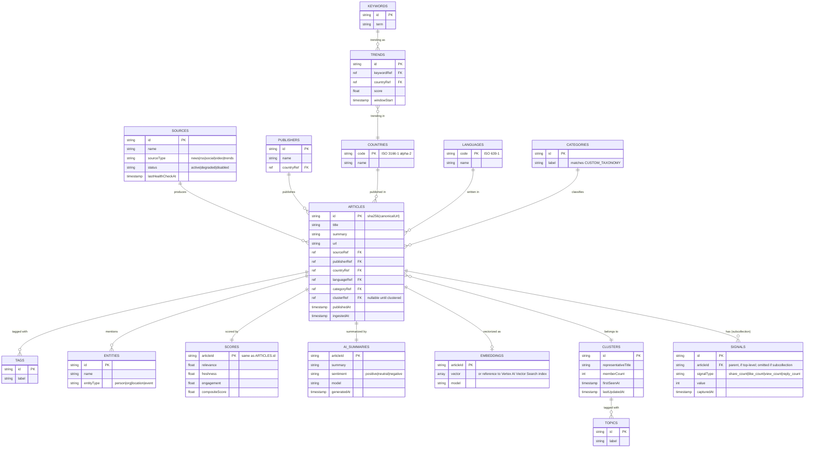

# Firestore schema

## Part 1 — current schema (live in `boxnewsbooster` today)

Three flat cache collections plus one config doc. No relationships, no
normalization — each query's full result set is cached as-is.

| Collection | Doc ID | Fields | TTL |
|---|---|---|---|
| `articleClassifications` | `sha256(canonicalUrl)` | `url, title, summary, customCategory, model, classifiedAt, ttlAt` | 180d cleanup |
| `newsQueryCache` | `sha256({provider,country,category,keyword,page})` | `articles[] (full NormalizedArticle, customCategory merged in), fetchedAt, ttlAt` | 7d cleanup, 15min freshness |
| `trendsCache` | `{countryCode}` | `country, trends[], fetchedAt, ttlAt` | 24h cleanup, 60min freshness (feature currently disabled — see `caching-strategy.md`) |
| `config` | `anthropic` | `modelId` (currently `claude-sonnet-5`) | none |

This works for a 2-provider, query-cache-only system. It does not scale to
5 sources with cross-source deduplication, clustering, or analytics — every
new capability (dedup, "same story from 3 sources", category trend-lines
over time) requires querying *articles as first-class entities*, which the
current model can't do (they're buried inside `newsQueryCache.articles[]`
arrays, not queryable individually).

## Part 2 — target schema

### Design decisions (per the guidance this schema was built against)

- **Reference fields, not nesting.** `articles/{id}.publisherRef`,
  `.countryRef`, `.categoryRef`, `.clusterRef` are all
  `DocumentReference`s, not inline copies of the full publisher/country/
  category object. Keeps `articles` docs small and makes updating a
  publisher's metadata a single-doc write instead of a fan-out rewrite.
- **Denormalize a few hot-read fields.** Despite the above, `articles` also
  stores `publisherName` and `countryCode` as plain strings *in addition to*
  the reference fields — the feed/list view reads these on every card render,
  and joining to `publishers`/`countries` for every list item would double
  read costs for no benefit (publisher name essentially never changes).
- **Subcollections for unbounded 1:many scoped to one parent.**
  `articles/{id}/signals/{signalId}` is a subcollection: a tweet's
  like/retweet count sampled every N minutes is unbounded over the article's
  lifetime and is *only ever* queried in the context of that one article —
  textbook subcollection case. `scores` and `ai_summaries` are **1:1** with
  `articles` (one score doc, one summary doc per article) — modeled as
  top-level collections keyed by the same ID as the article (not
  subcollections), because 1:1 data is cheap to `get()` directly by ID and
  doesn't need the subcollection's "always scoped to parent" property.
- **`clusters` is many:1 from `articles`**, not the reverse — an article
  belongs to at most one cluster (`articles.clusterRef`), and a cluster's
  member list is derived by querying `articles where clusterRef == X`, not
  stored as an array on the cluster doc (arrays of references get unwieldy
  and hit the 1MB doc size limit for very large clusters — a breaking news
  event pulled from 5 sources over 48h could plausibly hit dozens of members).

### Composite indexes needed (`firestore.indexes.json`)

The dashboard's expected query patterns, each requiring a composite index:

| Query | Index |
|---|---|
| Feed filtered by country + category, sorted by recency | `articles`: `countryRef ASC, categoryRef ASC, publishedAt DESC` |
| Trending topics for a country | `trends`: `countryRef ASC, windowStart DESC, score DESC` |
| Cluster members | `articles`: `clusterRef ASC, publishedAt DESC` |
| Unscored articles (ingestion backlog) | `articles`: `sourceRef ASC, ingestedAt ASC` (single-field — no composite needed if `scores` existence is checked in application code) |

## Migration path (current → target)

This is **not** a one-shot cutover — `fetchNews`/`classifyArticle`/
`getSearchTrends` keep working throughout:

1. `articleClassifications` → becomes the seed data for `articles` +
   `scores` + `ai_summaries`. A one-time backfill script reads every
   `articleClassifications` doc and writes the equivalent `articles` /
   `scores` docs, with `customCategory` resolved to a `categories` reference.
2. `newsQueryCache` → the new `search` callable stops caching *full article
   bodies* per query; it caches only the **ordered list of article IDs**
   matching a query (`queryResultCache/{queryHash}: {articleIds[], fetchedAt}`),
   since the articles themselves are now individually queryable and
   deduplicated. This eliminates the current design's biggest waste: the
   same NPR article about a housing bill being stored in full, redundantly,
   inside every country/category/page combination that happened to surface it.
3. `trendsCache` → once Google Trends is replaced (see
   `connector-interface.md`), becomes `trends/{trendId}` keyed by
   `(keywordRef, countryRef, windowStart)` instead of one blob per country.
4. `config/anthropic` → unchanged, still the single source of truth for the
   active model ID.
