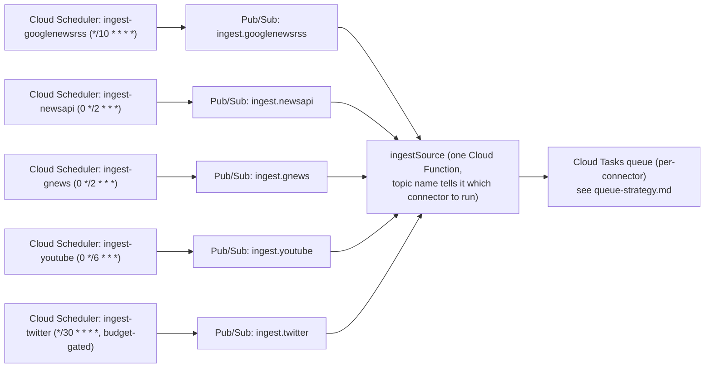

# Scheduling strategy

Ingestion (pulling fresh items from each source *before* anyone searches, so
the feed/analytics have data to query) runs on a schedule, independent of the
on-demand `search` callable. This is different from Phase 0's model, where
`fetchNews` only ever called a provider synchronously inside a user's request.

## Mechanism: Cloud Scheduler → Pub/Sub → Cloud Function

Firebase Functions v2's `onSchedule` (from `firebase-functions/v2/scheduler`)
creates the Cloud Scheduler job *and* the function in one deploy — no manual
`gcloud scheduler jobs create` needed. Each schedule publishes to its own
Pub/Sub topic; **one** `ingestSource` function subscribes to all of them and
dispatches to the right connector by topic name, rather than five near-
identical functions (less code duplication, one place to fix ingestion bugs).

## Cron expressions and reasoning per source

| Source | Cron | Interval | Why this cadence |
|---|---|---|---|
| Google News RSS | `*/10 * * * *` | 10 min | Free, no rate limit published, highest-value source for freshness — poll it the most aggressively |
| NewsAPI.org | `0 */2 * * *` | 2 hr | Free Developer tier: 100 requests/day total. Ingesting across ~7 categories × ~10 priority countries would blow the daily budget in hours at higher frequency — 2hr cadence with a curated country/category matrix (not all 53×7 combinations every run) keeps us under budget |
| GNews | `0 */2 * * *` | 2 hr | Same reasoning as NewsAPI.org — free tier is 100 requests/day |
| YouTube | `0 */6 * * *` | 6 hr | 100 quota units per `search.list` call, 10,000/day budget → ~100 searches/day max, and each ingestion run needs multiple searches (per category/keyword-set). 6hr cadence leaves quota headroom for on-demand `search` callable calls during the day, which also consume quota |
| Twitter/X | `*/30 * * * *`, **feature-flagged off until a paid tier is provisioned** | 30 min (once enabled) | Real-time social signal is Twitter's whole value proposition — 30min is the tightest cadence that still respects a Basic-tier request budget; tune once actual tier/pricing is confirmed (see `connector-interface.md`) |

## Pub/Sub topic naming convention

`ingest.{connectorId}` — e.g. `ingest.googlenewsrss`, `ingest.newsapi`,
`ingest.gnews`, `ingest.youtube`, `ingest.twitter`. The `ingestSource`
function reads `connectorId` from the topic name (or a small JSON payload
`{ connectorId, params }` if per-run parameters like "which category batch"
are needed) and looks it up via `connectors/index.ts`'s registry — same
registry the on-demand `search` callable uses, so there's exactly one place
that maps a string ID to a connector implementation.

## What ingestion actually does per run

1. `ingestSource` receives `{ connectorId }`.
2. Looks up the connector, calls `.fetch()` for its configured
   country/category/keyword matrix (from `config/sources.ts`).
3. Normalizes, dedupes against existing `articles` (via
   `services/dedup.ts`), enqueues genuinely-new items onto that connector's
   Cloud Tasks queue for classification (see `queue-strategy.md`) rather
   than classifying synchronously inline — keeps the scheduled function's
   own execution short and lets classification retry independently of
   ingestion.
4. Updates `sources/{sourceId}.lastHealthCheckAt` and a lightweight
   success/failure counter, feeding the `healthCheck` callable's dashboard.

## Budget circuit breaker

`config/sources.ts` tracks a rolling daily request count per connector
(stored in a small Firestore doc, not in-memory — ingestion runs are
independent function invocations with no shared memory). If a connector's
count approaches its known daily/monthly cap (NewsAPI 100/day, YouTube
10,000 units/day, Twitter's tier-specific cap), `ingestSource` **skips that
run** and logs a warning rather than eating an avoidable rate-limit error —
cheaper to skip one ingestion cycle than to have a provider temporarily
ban the API key for the rest of the day.
